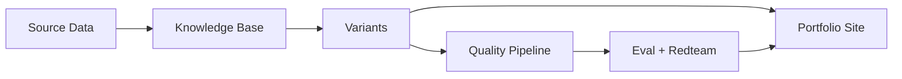

# Universal CV Portfolio Engine

A portfolio site that generates **job-targeted variants** using Claude Code. Feed it a job description, and it tailors your resume, case studies, and bio—then runs claims verification and adversarial red-team scans before publishing.

**Live:** [edgeoftrust.com](https://edgeoftrust.com) | **Stack:** React 19, TypeScript, Vite 7, Framer Motion

---

## Why This Exists

Job applications are a cold-start problem. Generic resumes get filtered; hand-tailored ones don't scale. This engine solves it by:

1. **Structuring career data once** — achievements, metrics, and stories in a queryable knowledge base
2. **Generating variants on demand** — AI matches your experience to job requirements
3. **Verifying before publishing** — claims are checked against source evidence; red-team scans catch tone/accuracy issues

The result: every application feels hand-crafted, but takes minutes instead of hours.

> **Want to build your own?** See the **[Getting Started Guide](./GETTING_STARTED_GUIDE.md)** for step-by-step instructions.

### How It Works



**Data Flow:**
1. **Source Data** → Raw career materials (reviews, LinkedIn, notes)
2. **Knowledge Base** → Structured achievements in STAR format
3. **Variants** → Job-targeted customizations
4. **Quality Pipeline** → Claims verification + adversarial scans
5. **Portfolio Site** → Live, personalized pages

---

## Prerequisites

Before you begin, ensure you have:

| Requirement | Notes |
|-------------|-------|
| **Node.js 18+** | [Download](https://nodejs.org/) |
| **npm** | Comes with Node.js |
| **Claude Code** | For skills automation. [Install](https://claude.ai/code) (optional - manual workflows available) |
| **API Key** | For AI features. See [`.env.example`](./.env.example) for options |

> **No Claude Code?** The [Getting Started Guide](./GETTING_STARTED_GUIDE.md) includes manual alternatives for each skill.

---

## 📍 Where to Start

| If you want to... | Read... |
|-------------------|---------|
| Understand what this is | This README |
| Build your own portfolio from scratch | [Getting Started Guide](./GETTING_STARTED_GUIDE.md) |
| Generate a job-targeted variant | [Universal CV Guide](./docs/guides/universal-cv.md) |
| Run the quality pipeline (eval + redteam) | [Capstone Workflow](./docs/guides/capstone-workflow.md) |
| Use the interactive CLI dashboard | [UCV-CLI Guide](./docs/guides/universal-cv-cli.md) |
| Contribute code or understand the architecture | [Codebase Context](./context/CODEBASE.md) |

---

## 🏛️ Project Structure

```
context/           → Architecture docs (CODEBASE.md, DESIGN.md, PROJECT_STATE.md)
content/           → Portfolio content (profile, variants, case studies, blog)
docs/guides/       → Reference guides (universal-cv, capstone-workflow, etc.)
.claude/skills/    → Claude Code automation (13 skills for content management)
capstone/          → Quality pipeline artifacts (evals, redteam reports)
```

**For AI agents**: Start with [CODEBASE.md](./context/CODEBASE.md) for architecture patterns.

**For contributors**: See [docs/guides/](./docs/guides/) for operational guides.

---

## 🚀 Quick Start (Operations)

### 🛠️ Local Development
```bash
# Setup & Dependency injection
npm install

# Start Local Instance (auto-syncs variants)
npm run dev

# Content Integrity Check
npm run validate
```

### 🎯 Personalization (Universal CV)
```bash
# Generate a tailored variant for a specific role
npm run generate:cv -- --company "Company" --role "Role" --jd "./jd.txt" --provider gemini

# Sync YAML variants to JSON (runs automatically on dev/build)
npm run variants:sync
```

### 🔍 Quality Pipeline (Capstone)
```bash
# PRE-GENERATION: Analyze JD and check alignment (deterministic)
npm run analyze:jd -- --file source-data/jd-stripe.txt --save
npm run search:evidence -- --jd-analysis capstone/develop/jd-analysis/stripe.yaml --save
npm run check:coverage

# POST-GENERATION: Verify claims and red team
npm run eval:variant -- --slug bloomberg-technical-product-manager
npm run redteam:variant -- --slug bloomberg-technical-product-manager

# CI gate checks
npm run eval:check
npm run redteam:check --strict
```

### 🖼️ OG Image Generation
```bash
# Generate social sharing images (requires Puppeteer)
npm run generate:og
```

---

## 🏗️ Technical Stack
**React 19 + TypeScript + Vite 7 + Framer Motion + Zod**

| Metric | Current | Target |
|--------|---------|--------|
| Bundle Size | 195KB gzip | <200KB ✅ |
| Tests | 210 passing | — |
| CSS Tokens | 120+ | — |
| Active Variants | 12 | — |

**Status**: Production
**Live URL**: [edgeoftrust.com](https://edgeoftrust.com)
**Recent**: Code splitting shipped (59% bundle reduction)
