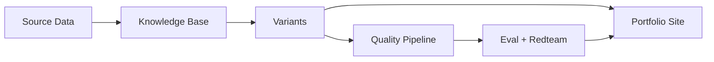

# Universal CV Portfolio Engine

A portfolio site that generates **job-targeted variants** using Claude Code. Feed it a job description, and it tailors your resume, case studies, and bio—then runs claims verification and adversarial red-team scans before publishing.

**Live:** [edgeoftrust.com](https://edgeoftrust.com) | **Stack:** React 19, TypeScript, Vite 7, Framer Motion

---

## Why This Exists

Job applications are a cold-start problem. Generic resumes get filtered; hand-tailored ones don't scale. This engine solves it by:

1. **Structuring career data once** — achievements, metrics, and stories in a queryable knowledge base
2. **Generating variants on demand** — AI matches your experience to job requirements
3. **Verifying before publishing** — claims are checked against source evidence; red-team scans catch tone/accuracy issues

The result: every application feels hand-crafted, but takes minutes instead of hours.

> **Want to build your own?** See the **[Getting Started Guide](./GETTING_STARTED_GUIDE.md)** for step-by-step instructions.

### How It Works



**Data Flow:**
1. **Source Data** → Raw career materials (reviews, LinkedIn, notes)
2. **Knowledge Base** → Structured achievements in STAR format
3. **Variants** → Job-targeted customizations
4. **Quality Pipeline** → Claims verification + adversarial scans
5. **Portfolio Site** → Live, personalized pages

---

## Prerequisites

Before you begin, ensure you have:

| Requirement | Notes |
|-------------|-------|
| **Node.js 18+** | [Download](https://nodejs.org/) |
| **npm** | Comes with Node.js |
| **Claude Code** | For skills automation. [Install](https://claude.ai/code) (optional - manual workflows available) |
| **API Key** | For AI features. See [`.env.example`](./.env.example) for options |

> **No Claude Code?** The [Getting Started Guide](./GETTING_STARTED_GUIDE.md) includes manual alternatives for each skill.

---

## 📍 Where to Start

| If you want to... | Read... |
|-------------------|---------|
| Understand what this is | This README |
| Build your own portfolio from scratch | [Getting Started Guide](./GETTING_STARTED_GUIDE.md) |
| Generate a job-targeted variant | [Universal CV Guide](./docs/guides/universal-cv.md) |
| Run the quality pipeline (eval + redteam) | [Capstone Workflow](./docs/guides/capstone-workflow.md) |
| Use the interactive CLI dashboard | [UCV-CLI Guide](./docs/guides/universal-cv-cli.md) |
| Contribute code or understand the architecture | [Codebase Context](./context/CODEBASE.md) |

---

## 🏛️ Project Structure

### 🧠 [Active Context](./context/) (Read this first)
The "Brain" of the project. Essential for AI agents and strategic planning.
*   **[PROJECT STATE](./context/PROJECT_STATE.md)**: Single source of truth including:
    - Part I: Strategic Audit
    - Part II: Priority Action Plan
    - Part III: Agent Governance
    - Part IV: Roadmap
    - Part V: Capstone Pipeline
    - Part VI: Session Log (last 3 sessions)
*   **[CODEBASE Architecture](./context/CODEBASE.md)**: High-level system design and patterns.
*   **[DESIGN System](./context/DESIGN.md)**: Visual tokens (120+ CSS variables), typography, and theme parity.

### 📖 [Reference Guides](./docs/)
Operational details for managing the engine.
*   **[Content Management](./docs/guides/content-management.md)**: Schema definitions for YAML/MD.
*   **[Universal CV](./docs/guides/universal-cv.md)**: Personalization engine documentation.
*   **[Capstone Workflow](./docs/guides/capstone-workflow.md)**: Quality pipeline (eval → redteam → deploy).
*   **[Universal CV CLI](./docs/guides/universal-cv-cli.md)**: Interactive dashboard and CLI tools.
*   **[Adding Case Studies](./docs/guides/adding-case-studies.md)**: Workflow for new editorial content.
*   **[CV Data Ingestion](./docs/guides/cv-data-ingestion.md)**: AI-assisted career data import.

### 🤖 [Claude Code Skills](./.claude/skills/)
AI-powered automation skills for content management.
*   **[ultrathink](./.claude/skills/ultrathink/SKILL.md)**: Elevated problem-solving. Craftsman mindset for architectural decisions.
*   **[sprint-sync](./.claude/skills/sprint-sync/SKILL.md)**: Multi-perspective project onboarding (PM, Designer, Architect, Engineer views).
*   **[run-tests](./.claude/skills/run-tests/SKILL.md)**: Run test suite and identify gaps.
*   **[serghei-qa](./.claude/skills/serghei-qa/SKILL.md)**: Brutally honest code audits with best-practice fixes.
*   **[reorient](./.claude/skills/reorient/SKILL.md)**: ADHD-aware reality checks when drifting.
*   **[dmitrii-writing-style](./.claude/skills/dmitrii-writing-style/SKILL.md)**: Authentic voice for all written content.
*   **[cv-data-ingestion](./.claude/skills/cv-data-ingestion/SKILL.md)**: Import career data from Obsidian, CSV, zip archives.
*   **[cv-content-generator](./.claude/skills/cv-content-generator/SKILL.md)**: Generate case studies, blog posts, variants.
*   **[cv-content-editor](./.claude/skills/cv-content-editor/SKILL.md)**: Edit existing CV content.
*   **[cv-knowledge-query](./.claude/skills/cv-knowledge-query/SKILL.md)**: Query achievements and stories.
*   **[generate-variant](./.claude/skills/generate-variant/SKILL.md)**: Job-targeted CV variants with quality gates.
*   **[generate-story-bank](./.claude/skills/generate-story-bank/SKILL.md)**: HPARL interview stories from achievements.
*   **[generate-resume](./.claude/skills/generate-resume/SKILL.md)**: Print-optimized, ATS-friendly PDF resumes.

#### Skill Recipes
Skills compose automatically. These combinations create outcomes greater than their parts:

| Recipe | What Emerges |
|--------|--------------|
| `ultrathink + dmitrii-writing-style` | Architecturally sound + authentically voiced content |
| `ultrathink + serghei-qa` | Design-then-destroy: craft first, roast second |
| `ultrathink + generate-variant` | Job applications that feel *inevitable* |
| `ultrathink + reorient` | Productive tension: dream ↔ pragmatism |
| `serghei-qa + run-tests` | Quality sweep: find issues, verify fixes |

### 🔬 [Capstone Quality Pipeline](./capstone/)
AI product evaluation framework for variant quality assurance.
*   **[Evaluation Rubric](./capstone/develop/evaluation.md)**: Claims verification methodology.
*   **[Red Team Threat Model](./capstone/develop/red-teaming.md)**: Adversarial checks for portfolio risks.
*   **[Claims Ledgers](./capstone/develop/evals/)**: Machine-checkable verification per variant.
*   **[Red Team Reports](./capstone/develop/redteam/)**: Adversarial scan results.

### 🗄️ [Historical Archive](./docs/history/)
Past plans, refactoring logs, and legacy prompts (including archived AGENT_RULES.md, ROADMAP.md).

---

## 🚀 Quick Start (Operations)

### 🛠️ Local Development
```bash
# Setup & Dependency injection
npm install

# Start Local Instance (auto-syncs variants)
npm run dev

# Content Integrity Check
npm run validate
```

### 🎯 Personalization (Universal CV)
```bash
# Generate a tailored variant for a specific role
npm run generate:cv -- --company "Company" --role "Role" --jd "./jd.txt" --provider gemini

# Sync YAML variants to JSON (runs automatically on dev/build)
npm run variants:sync
```

### 🔍 Quality Pipeline (Capstone)
```bash
# PRE-GENERATION: Analyze JD and check alignment (deterministic)
npm run analyze:jd -- --file source-data/jd-stripe.txt --save
npm run search:evidence -- --jd-analysis capstone/develop/jd-analysis/stripe.yaml --save
npm run check:coverage

# POST-GENERATION: Verify claims and red team
npm run eval:variant -- --slug bloomberg-technical-product-manager
npm run redteam:variant -- --slug bloomberg-technical-product-manager

# CI gate checks
npm run eval:check
npm run redteam:check --strict
```

### 🖼️ OG Image Generation
```bash
# Generate social sharing images (requires Puppeteer)
npm run generate:og
```

---

## 🏗️ Technical Stack
**React 19 + TypeScript + Vite 7 + Framer Motion + Zod**

| Metric | Current | Target |
|--------|---------|--------|
| Bundle Size | 195KB gzip | <200KB ✅ |
| Tests | 210 passing | — |
| CSS Tokens | 120+ | — |
| Active Variants | 12 | — |

**Status**: Production
**Live URL**: [edgeoftrust.com](https://edgeoftrust.com)
**Recent**: Code splitting shipped (59% bundle reduction)
