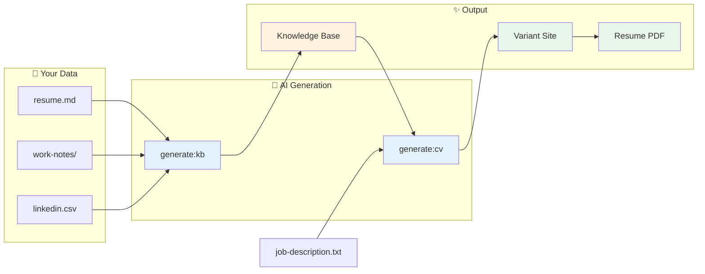

# Universal CV: Zero to Portfolio in 5 Commands

> **Transform your career history into AI-powered, job-targeted portfolios**

No templates to fill. No YAML to write. Just drop your career data and let the automation do the work.

---

<div align="center">

```
┌─────────────────────────────────────────────────────────────────────────────┐
│                                                                             │
│     resume.md                                                               │
│     work-notes/        ───▶  npm run generate:kb  ───▶  KNOWLEDGE BASE     │
│     linkedin.csv                    (AI)                                    │
│                                                                             │
│                                      │                                      │
│                                      ▼                                      │
│                                                                             │
│     job-description.txt ───▶  npm run generate:cv ───▶  VARIANT + RESUME   │
│                                      (AI)                                   │
│                                                                             │
└─────────────────────────────────────────────────────────────────────────────┘
```

</div>

---

## Table of Contents

1. [Quick Start (5 Minutes)](#quick-start-5-minutes)
2. [The Complete Pipeline](#the-complete-pipeline)
3. [Step 1: Prepare Your Source Data](#step-1-prepare-your-source-data)
4. [Step 2: Generate Your Knowledge Base](#step-2-generate-your-knowledge-base)
5. [Step 3: Create Job-Targeted Variants](#step-3-create-job-targeted-variants)
6. [Step 4: Quality Verification](#step-4-quality-verification)
7. [Step 5: Generate Resume PDFs](#step-5-generate-resume-pdfs)
8. [Command Reference](#command-reference)
9. [Troubleshooting](#troubleshooting)

---

## Quick Start (5 Minutes)

```bash
# 1. Clone and install
git clone https://github.com/yourusername/universal-cv.git my-portfolio
cd my-portfolio && npm install

# 2. Add your API key
export ANTHROPIC_API_KEY="sk-ant-..."  # or GEMINI_API_KEY for free tier

# 3. Drop your career data
mkdir -p source-data
cp ~/Documents/resume.md source-data/
cp ~/Documents/work-notes/* source-data/

# 4. Generate everything
npm run generate:kb -- --source ./source-data           # Creates knowledge base
npm run generate:cv -- --company "Stripe" --role "PM" --jd ./stripe-jd.txt  # Creates variant
npm run generate:resume -- --variant stripe-pm          # Creates PDF

# 5. Preview
npm run dev  # Visit http://localhost:5173/stripe/pm
```

**That's it.** Your tailored portfolio is live.

---

## The Complete Pipeline



### What Each Step Produces

| Step | Command | Input | Output |
|------|---------|-------|--------|
| **1. Knowledge Base** | `npm run generate:kb` | Your career data | Structured achievements, skills, experience |
| **2. Variant** | `npm run generate:cv` | Job description + KB | Tailored portfolio for that role |
| **3. Verify** | `npm run eval:variant` | Variant | Claims verified against KB |
| **4. Resume** | `npm run generate:resume` | Variant | Print-ready PDF |

---

## Step 1: Prepare Your Source Data

### Create the Source Directory

```bash
mkdir -p source-data
```

### What to Include

Drop **any** of these files into `source-data/`:

```
source-data/
├── resume.md              # Your resume (any format works)
├── resume.pdf             # PDFs are extracted automatically
├── linkedin-export.csv    # LinkedIn data export
├── work-notes/            # Project notes, achievements
│   ├── company-a.md
│   ├── company-b.md
│   └── project-notes.md
├── reviews/               # Performance reviews
│   └── 2024-review.md
└── achievements.txt       # Any loose notes
```

### Supported Formats

| Format | Extension | Notes |
|--------|-----------|-------|
| Markdown | `.md` | Best for structured notes |
| Plain text | `.txt` | Any text dump works |
| CSV | `.csv` | LinkedIn exports, spreadsheets |
| JSON | `.json` | Structured data exports |

### Example: Minimal Source File

Even a single file works. Here's a minimal `resume.md`:

```markdown
# Jane Smith
Senior Product Manager

## Experience

### Stripe (2022-Present)
Senior Product Manager - Payments Platform
- Reduced checkout abandonment by 34%, adding $2.1M ARR
- Led cross-functional team of 12 engineers
- Shipped new payment methods to 15 countries

### Acme Corp (2019-2022)
Product Manager - Growth
- Increased user activation by 45%
- Built ML-powered recommendation engine
- Managed $500K annual budget

## Skills
Product Strategy, Data Analysis, SQL, Python, A/B Testing
```

### Pro Tips

1. **Include metrics** - Numbers get extracted as verifiable achievements
2. **Name companies clearly** - Helps with entity extraction
3. **Include dates** - Enables timeline generation
4. **Add testimonials** - Quotes become social proof

---

## Step 2: Generate Your Knowledge Base

### Get Your API Key

Choose one provider:

| Provider | Cost | Get Key |
|----------|------|---------|
| **Gemini** | Free tier! | [makersuite.google.com](https://makersuite.google.com/app/apikey) |
| **Claude** | ~$0.50/run | [console.anthropic.com](https://console.anthropic.com) |
| **OpenAI** | ~$0.30/run | [platform.openai.com](https://platform.openai.com/api-keys) |

### Set Your API Key

```bash
# Option A: Gemini (Free!)
export GEMINI_API_KEY="AIzaSy..."

# Option B: Claude (Best quality)
export ANTHROPIC_API_KEY="sk-ant-..."

# Option C: OpenAI
export OPENAI_API_KEY="sk-..."
```

### Run the Generator

```bash
# Using default provider (Claude)
npm run generate:kb -- --source ./source-data

# Using Gemini (free)
npm run generate:kb -- --source ./source-data --provider gemini

# Preview first (dry run)
npm run generate:kb -- --source ./source-data --dry-run
```

### What Gets Created

```
content/
├── knowledge/
│   ├── index.yaml              # Entity graph (companies, skills, themes)
│   ├── achievements/
│   │   ├── stripe-checkout-optimization.yaml
│   │   ├── stripe-international-expansion.yaml
│   │   ├── acme-user-activation.yaml
│   │   └── acme-recommendation-engine.yaml
│   └── stories/
│       └── checkout-transformation.yaml
├── experience/
│   └── index.yaml              # Work history with highlights
├── skills/
│   └── index.yaml              # Categorized skills
└── profile.yaml                # Basic profile info
```

### Example: Generated Achievement

The AI extracts your accomplishments into structured STAR format:

```yaml
# content/knowledge/achievements/stripe-checkout-optimization.yaml

id: stripe-checkout-optimization
headline: "Reduced checkout abandonment by 34%, adding $2.1M ARR"

metric:
  value: "34%"
  unit: "reduction in abandonment"
  context: "$2.1M annual revenue impact"

situation: |
  Stripe's checkout flow had a 12% abandonment rate,
  significantly higher than industry benchmarks.

task: |
  Lead initiative to identify friction points and
  redesign the payment experience.

action: |
  - Analyzed 50K checkout sessions to identify drop-off points
  - A/B tested 12 variations of the payment form
  - Implemented progressive disclosure for payment methods
  - Added trust signals at key decision points

result: |
  - Abandonment dropped from 12% to 7.9% (34% reduction)
  - Generated $2.1M in recovered annual revenue
  - Approach adopted across all Stripe checkout products

skills:
  - data-analysis
  - ab-testing
  - product-strategy

themes:
  - revenue-growth
  - user-experience

companies:
  - stripe

years:
  - 2023
  - 2024

good_for:
  - "Payment/fintech PM roles"
  - "Growth-focused positions"
  - "Data-driven product questions"

evidence:
  metrics_source: "Stripe analytics dashboard"
```

### Validate the Output

```bash
npm run validate
```

Expected output:

```
✓ content/knowledge/index.yaml
✓ content/knowledge/achievements/stripe-checkout-optimization.yaml
✓ content/knowledge/achievements/acme-user-activation.yaml
✓ content/experience/index.yaml
✓ content/skills/index.yaml
✓ content/profile.yaml

All 6 files validated successfully!
```

---

## Step 3: Create Job-Targeted Variants

### Save the Job Description

```bash
# Save JD to a file
cat > target-job.txt << 'EOF'
Senior Product Manager - Payments
Company: FinanceFlow

About the Role:
We're looking for a PM to lead our payment optimization initiatives.
You'll work with engineering to reduce checkout friction and
increase conversion rates.

Requirements:
- 5+ years product management experience
- Experience with payment systems
- Strong data analysis skills
- Track record of improving conversion metrics
EOF
```

### Generate the Variant

```bash
npm run generate:cv -- \
  --company "FinanceFlow" \
  --role "Senior PM" \
  --jd ./target-job.txt
```

### What Gets Created

```yaml
# content/variants/financeflow-senior-pm.yaml

metadata:
  company: "FinanceFlow"
  role: "Senior PM"
  slug: "financeflow-senior-pm"
  generatedAt: "2025-01-15T10:30:00Z"
  publishStatus: "draft"

overrides:
  hero:
    status: "Open to Payment Platform Roles"
    headline:
      - text: "Turning"
        style: "normal"
      - text: "checkout friction"
        style: "accent"
      - text: "into revenue"
        style: "muted"
    subheadline: "PM who shipped 34% abandonment reduction and $2.1M ARR at Stripe"

  about:
    tagline: "Payment optimization specialist with proven conversion impact"
    bio:
      - "At Stripe, I led the checkout optimization initiative that reduced abandonment by 34%—recovering $2.1M in annual revenue."
      - "My approach: data first, assumptions second. Every decision backed by user research and A/B testing."
    stats:
      - value: "34%"
        label: "Abandonment Reduction"
      - value: "$2.1M"
        label: "Revenue Recovered"
      - value: "5+"
        label: "Years in Payments"

relevance:
  caseStudies:
    - slug: "stripe-checkout-optimization"
      relevanceScore: 0.98
      reasoning: "Direct payment optimization experience"
```

### Preview Your Variant

```bash
npm run dev
```

Visit: `http://localhost:5173/financeflow/senior-pm`

---

## Step 4: Quality Verification

### Verify Claims Against Knowledge Base

Every metric in your variant is traced back to your knowledge base:

```bash
npm run eval:variant -- --slug financeflow-senior-pm
```

Output:

```
╔═══════════════════════════════════════════════════════════════╗
║              CLAIMS VERIFICATION                              ║
╠═══════════════════════════════════════════════════════════════╣
║ Variant: financeflow-senior-pm                                ║
║ Claims Found: 3                                               ║
║ Verified: 3/3 (100%)                                          ║
╚═══════════════════════════════════════════════════════════════╝

VERIFIED CLAIMS:
────────────────
✓ "34% abandonment reduction"
  Source: achievements/stripe-checkout-optimization.yaml

✓ "$2.1M ARR"
  Source: achievements/stripe-checkout-optimization.yaml

✓ "5+ years in payments"
  Source: experience/index.yaml
```

### Red Team Scan

Check for tone issues, accuracy problems, and safety concerns:

```bash
npm run redteam:variant -- --slug financeflow-senior-pm
```

Output:

```
RED TEAM REPORT: financeflow-senior-pm
──────────────────────────────────────

PASS (5)  WARN (0)  FAIL (0)

✓ Professional tone maintained
✓ All claims verified against sources
✓ No exaggeration detected
✓ Metrics match source evidence
✓ No safety concerns

Status: READY FOR USE
```

---

## Step 5: Generate Resume PDFs

### Single Resume

```bash
# Start dev server (if not running)
npm run dev &

# Generate PDF
npm run generate:resume -- --variant financeflow-senior-pm
```

Output:

```
Generating resume for: financeflow-senior-pm
✓ Loaded variant configuration
✓ Rendered resume at 816x1056 (letter size)
✓ PDF saved: public/resumes/financeflow-senior-pm.pdf
```

### All Resumes (Batch)

```bash
npm run generate:resumes:all
```

---

## The Complete Workflow

Here's everything in one script:

```bash
#!/bin/bash
# complete-workflow.sh

set -e  # Exit on error

COMPANY="$1"
ROLE="$2"
JD_FILE="$3"

if [ -z "$COMPANY" ] || [ -z "$ROLE" ] || [ -z "$JD_FILE" ]; then
    echo "Usage: ./complete-workflow.sh <company> <role> <jd-file>"
    echo "Example: ./complete-workflow.sh Stripe 'Senior PM' ./stripe-jd.txt"
    exit 1
fi

SLUG=$(echo "${COMPANY}-${ROLE}" | tr '[:upper:]' '[:lower:]' | tr ' ' '-')

echo "═══════════════════════════════════════════════════"
echo "  UNIVERSAL CV PIPELINE"
echo "  Company: $COMPANY"
echo "  Role: $ROLE"
echo "═══════════════════════════════════════════════════"

echo ""
echo "Step 1: Generating variant..."
npm run generate:cv -- --company "$COMPANY" --role "$ROLE" --jd "$JD_FILE"

echo ""
echo "Step 2: Syncing variant..."
npm run variants:sync

echo ""
echo "Step 3: Verifying claims..."
npm run eval:variant -- --slug "$SLUG"

echo ""
echo "Step 4: Red team scan..."
npm run redteam:variant -- --slug "$SLUG"

echo ""
echo "Step 5: Generating resume..."
npm run generate:resume -- --variant "$SLUG"

echo ""
echo "═══════════════════════════════════════════════════"
echo "  ✓ COMPLETE!"
echo ""
echo "  Portfolio: http://localhost:5173/${COMPANY,,}/${ROLE,,}"
echo "  Resume: public/resumes/${SLUG}.pdf"
echo "═══════════════════════════════════════════════════"
```

Usage:

```bash
chmod +x complete-workflow.sh
./complete-workflow.sh "Stripe" "Senior PM" ./stripe-jd.txt
```

---

## Command Reference

### Generation Commands

| Command | Purpose | Example |
|---------|---------|---------|
| `generate:kb` | Create knowledge base from source data | `npm run generate:kb -- --source ./source-data` |
| `generate:cv` | Create variant from job description | `npm run generate:cv -- --company X --role Y --jd ./jd.txt` |
| `generate:resume` | Create PDF from variant | `npm run generate:resume -- --variant slug` |

### Quality Commands

| Command | Purpose | Example |
|---------|---------|---------|
| `validate` | Check all YAML against schemas | `npm run validate` |
| `eval:variant` | Verify claims in variant | `npm run eval:variant -- --slug name` |
| `redteam:variant` | Scan for issues | `npm run redteam:variant -- --slug name` |

### Analysis Commands

| Command | Purpose | Example |
|---------|---------|---------|
| `analyze:jd` | Parse job description | `npm run analyze:jd -- --file jd.txt` |
| `search:evidence` | Find matching achievements | `npm run search:evidence -- --terms "payment,conversion"` |

### Full Options

```bash
# Knowledge Base Generation
npm run generate:kb -- \
  --source ./source-data \     # Path to source files (required)
  --provider claude \          # AI: claude, openai, gemini
  --dry-run \                  # Preview without writing
  --verbose                    # Detailed output

# Variant Generation
npm run generate:cv -- \
  --company "Company" \        # Company name (required)
  --role "Role" \              # Role title (required)
  --jd ./jd.txt \             # Job description file (required)
  --provider claude \          # AI: claude, openai, gemini
  --values "Company values" \  # Optional context
  --output ./custom-path.yaml  # Custom output path

# Resume Generation
npm run generate:resume -- \
  --variant slug \             # Variant slug
  --name "Custom Name" \       # Override name
  --url http://localhost:5173  # Custom dev server URL
```

---

## Troubleshooting

### "No API key found"

```bash
# Check if key is set
echo $ANTHROPIC_API_KEY  # Should show your key

# Set it if missing
export ANTHROPIC_API_KEY="sk-ant-..."

# Or use inline
npm run generate:kb -- --source ./data --api-key "sk-ant-..."
```

### "No supported files found"

```bash
# Check file extensions
ls -la source-data/

# Supported: .md, .txt, .csv, .json
# NOT supported: .pdf (convert to text first), .docx
```

### "Validation failed"

```bash
# See detailed errors
npm run validate

# Common fixes:
# - Ensure dates are "YYYY – YYYY" format
# - Skills must be simple strings, not objects
# - Check for YAML syntax errors
```

### "Resume generation failed"

```bash
# Ensure dev server is running
npm run dev

# Check if port 5173 is available
lsof -i :5173

# Try different port
npm run dev -- --port 3000
npm run generate:resume -- --url http://localhost:3000
```

### "AI response parse error"

```bash
# Try again - API responses can vary
npm run generate:kb -- --source ./data

# Or try a different provider
npm run generate:kb -- --source ./data --provider gemini

# Or use verbose mode to debug
npm run generate:kb -- --source ./data --verbose
```

---

## Architecture

### How It All Connects

```
┌─────────────────────────────────────────────────────────────────────────────┐
│                         UNIVERSAL CV ARCHITECTURE                            │
├─────────────────────────────────────────────────────────────────────────────┤
│                                                                             │
│  SOURCE DATA                         KNOWLEDGE BASE                         │
│  ───────────                         ──────────────                         │
│  source-data/                        content/knowledge/                     │
│  ├── resume.md        ─────▶        ├── index.yaml (entities)              │
│  ├── work-notes/      generate:kb   ├── achievements/*.yaml                │
│  └── linkedin.csv                    └── stories/*.yaml                     │
│                                                                             │
│                                              │                              │
│                                              ▼                              │
│                                                                             │
│  JOB DESCRIPTION                     VARIANT                                │
│  ───────────────                     ───────                                │
│  source-data/jds/    ─────▶         content/variants/                       │
│  └── stripe-pm.txt   generate:cv    └── stripe-pm.yaml                     │
│                                                                             │
│                                              │                              │
│                                              ▼                              │
│                                                                             │
│  QUALITY PIPELINE                    OUTPUTS                                │
│  ────────────────                    ───────                                │
│  eval:variant        ─────▶         • Portfolio site                        │
│  redteam:variant                    • Resume PDF                            │
│                                     • Claims verification                   │
│                                                                             │
└─────────────────────────────────────────────────────────────────────────────┘
```

### File Structure

```
my-portfolio/
├── source-data/                    # YOUR INPUT (gitignored)
│   ├── resume.md
│   ├── work-notes/
│   └── jds/
│
├── content/                        # GENERATED + EDITABLE
│   ├── knowledge/                  # ← generate:kb creates this
│   │   ├── index.yaml
│   │   ├── achievements/
│   │   └── stories/
│   ├── experience/
│   ├── skills/
│   ├── profile.yaml
│   └── variants/                   # ← generate:cv creates these
│       └── *.yaml
│
├── public/
│   └── resumes/                    # ← generate:resume creates PDFs
│       └── *.pdf
│
├── scripts/                        # CLI TOOLS
│   ├── generate-knowledge-base.ts
│   ├── generate-cv.ts
│   ├── generate-resume.ts
│   └── ...
│
└── capstone/develop/               # QUALITY ARTIFACTS
    ├── evals/                      # Claims verification
    └── redteam/                    # Safety scans
```

---

## Next Steps

1. **Add more source data** - The more you provide, the richer your knowledge base
2. **Create multiple variants** - One knowledge base powers unlimited tailored applications
3. **Review and refine** - Edit generated files to add nuance
4. **Deploy** - Push to Vercel/Netlify for a live portfolio

---

<div align="center">

**Built with Universal CV**

*Your career, structured. Your applications, tailored. Your time, saved.*

[Full Documentation](../universal-cv.md) · [CLI Reference](../universal-cv-cli.md) · [Report Issues](https://github.com/yourusername/portfolio/issues)

</div>
