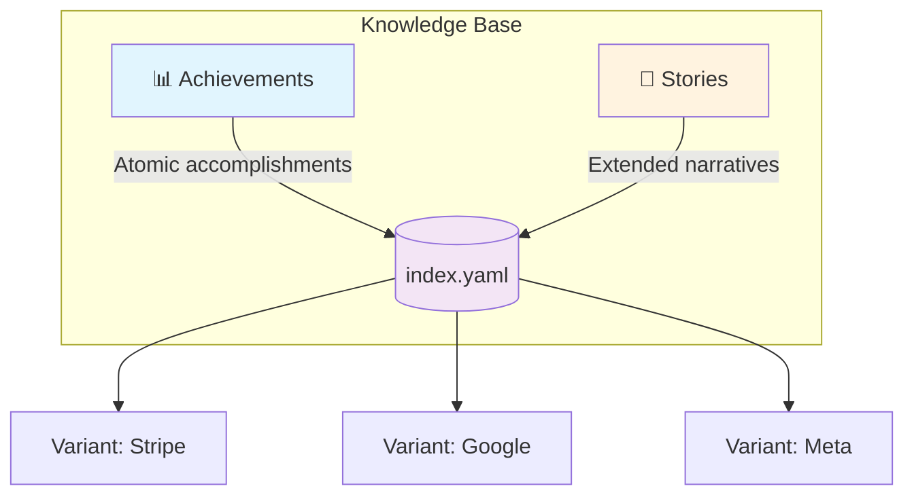
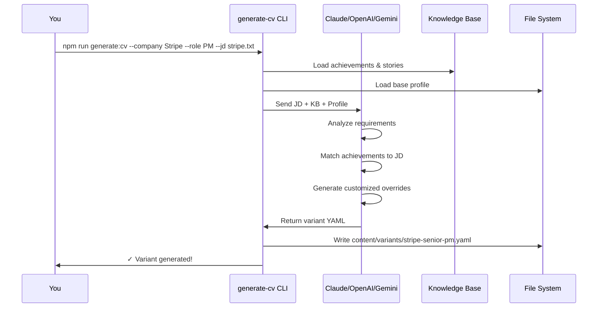

# Universal CV: From Raw Experience to Job-Winning Variants

> **A Complete Guide to Building Your Knowledge-Driven Portfolio System**

Transform your career history into an AI-powered variant engine that generates perfectly tailored portfolios and resumes for any job description.

---

## Table of Contents

1. [Overview](#overview)
2. [Prerequisites](#prerequisites)
3. [Project Setup](#project-setup)
4. [Phase 1: Organize Your Source Data](#phase-1-organize-your-source-data)
5. [Phase 2: Build Your Knowledge Base](#phase-2-build-your-knowledge-base)
6. [Phase 3: Analyze Job Descriptions](#phase-3-analyze-job-descriptions)
7. [Phase 4: Generate Variants](#phase-4-generate-variants)
8. [Phase 5: Quality Pipeline](#phase-5-quality-pipeline)
9. [Phase 6: Generate Resume PDFs](#phase-6-generate-resume-pdfs)
10. [Appendix: Templates & Schemas](#appendix-templates--schemas)

---

## Overview

### What You'll Build

```
┌─────────────────────────────────────────────────────────────────────────────┐
│                                                                             │
│   YOUR EXPERIENCE                    JOB DESCRIPTION                        │
│   ───────────────                    ───────────────                        │
│   • Past roles                       • Company: Stripe                      │
│   • Achievements                     • Role: Senior PM                      │
│   • Metrics & impact                 • Requirements: [...]                  │
│                                                                             │
│                        ┌─────────────────────┐                              │
│              ┌────────▶│   KNOWLEDGE BASE    │◀────────┐                    │
│              │         │   (Source of Truth) │         │                    │
│              │         └──────────┬──────────┘         │                    │
│              │                    │                    │                    │
│              │                    ▼                    │                    │
│              │         ┌─────────────────────┐         │                    │
│              │         │   AI VARIANT GEN    │         │                    │
│              │         │   (Claude API)      │         │                    │
│              │         └──────────┬──────────┘         │                    │
│              │                    │                    │                    │
│              │                    ▼                    │                    │
│              │    ┌───────────────────────────────┐    │                    │
│              │    │                               │    │                    │
│              │    │  ┌─────────┐   ┌──────────┐  │    │                    │
│              │    │  │ VARIANT │   │  RESUME  │  │    │                    │
│              │    │  │  SITE   │   │   PDF    │  │    │                    │
│              │    │  └─────────┘   └──────────┘  │    │                    │
│              │    │                               │    │                    │
│              │    │   yoursite.com/stripe/pm     │    │                    │
│              │    │                               │    │                    │
│              │    └───────────────────────────────┘    │                    │
│              │                                         │                    │
│              └─────────────────────────────────────────┘                    │
│                                                                             │
└─────────────────────────────────────────────────────────────────────────────┘
```

### The Power of This System

| Traditional Approach | Universal CV |
|---------------------|--------------|
| One resume fits all | Unlimited tailored variants |
| Manual customization per job | AI-generated in minutes |
| Claims without evidence | Every metric traced to source |
| Hope it passes ATS | Built-in quality verification |
| Scattered career notes | Centralized knowledge base |

---

## Prerequisites

### Required

- **Node.js** v18+ ([Download](https://nodejs.org))
- **Git** ([Download](https://git-scm.com))
- **API Key** for one of:
  - [Anthropic Claude](https://console.anthropic.com) (Recommended)
  - [OpenAI](https://platform.openai.com/api-keys)
  - [Google Gemini](https://makersuite.google.com/app/apikey) (Free tier available!)

### Your Career Data

Gather these materials before starting:

```
□ Current resume (any format)
□ LinkedIn profile export (Settings → Get a copy of your data)
□ Performance reviews
□ Project documentation
□ Awards/recognition emails
□ Metrics from dashboards
□ Testimonials/recommendations
```

---

## Project Setup

### Step 1: Clone the Repository

```bash
# Clone the Universal CV template
git clone https://github.com/yourusername/portfolio.git my-portfolio
cd my-portfolio

# Install dependencies
npm install
```

### Step 2: Configure Environment

```bash
# Copy the environment template
cp .env.example .env.local
```

Edit `.env.local` and add your API key:

```bash
# Choose ONE provider:

# Option A: Anthropic Claude (Best quality)
ANTHROPIC_API_KEY=sk-ant-api03-xxxxxxxxxxxxx

# Option B: OpenAI
OPENAI_API_KEY=sk-xxxxxxxxxxxxx

# Option C: Google Gemini (Free tier!)
GEMINI_API_KEY=AIzaSyxxxxxxxxxxxxx
```

### Step 3: Verify Installation

```bash
# Run validation to ensure everything works
npm run validate

# Start the dev server
npm run dev
```

Visit `http://localhost:5173` to see the base portfolio.

---

## Phase 1: Organize Your Source Data

### Directory Structure

Create folders for your raw career data:

```bash
mkdir -p source-data/{work-notes,jds,screenshots}
```

Your `source-data/` folder should look like:

```
source-data/
├── resume.pdf                    # Your current resume
├── linkedin-export.csv           # LinkedIn data export
├── work-notes/                   # Career notes & achievements
│   ├── company-a-notes.md
│   ├── company-b-projects.md
│   └── performance-reviews.md
├── jds/                          # Job descriptions (gitignored)
│   ├── stripe-pm.txt
│   └── google-tpm.txt
└── screenshots/                  # Visual evidence
    ├── metrics-dashboard.png
    └── award-email.png
```

### Formatting Your Work Notes

Create markdown files with your achievements. Here's an example structure:

```markdown
<!-- source-data/work-notes/acme-corp-notes.md -->

# Acme Corp (2021-2023)
## Role: Senior Product Manager

### Project: Payment Platform Overhaul

**Context:** Legacy payment system causing 15% cart abandonment

**What I Did:**
- Led cross-functional team of 8 engineers + 2 designers
- Conducted 25+ customer interviews to identify pain points
- Designed new checkout flow with 3-step wizard

**Results:**
- Reduced cart abandonment from 15% to 4%
- Increased conversion rate by 23%
- $2.3M additional annual revenue

**Quote from VP Engineering:**
> "This was the smoothest product launch in company history"

---

### Project: Mobile App Launch

**Context:** No mobile presence, competitors gaining share

...
```

> **Tip:** Include specific numbers, percentages, and dollar amounts wherever possible. These become your verifiable claims.

---

## Phase 2: Build Your Knowledge Base

The knowledge base is the **source of truth** for all your variants. It consists of two types of content:



### Step 1: Create the Entity Graph

The entity graph defines your companies, skills, and themes:

```yaml
# content/knowledge/index.yaml

version: "1.0"
description: "Career knowledge base entity graph"

entities:
  companies:
    acme-corp:
      name: "Acme Corporation"
      period: "2021-2023"
      role: "Senior Product Manager"
      domain: "Fintech / Payments"

    techstart:
      name: "TechStart Inc"
      period: "2019-2021"
      role: "Product Manager"
      domain: "SaaS / Developer Tools"

    # Add all your companies...

  themes:
    revenue-growth:
      label: "Revenue Growth"
      description: "Initiatives that directly impacted revenue"

    developer-experience:
      label: "Developer Experience"
      description: "Improving tools and workflows for developers"

    cross-functional:
      label: "Cross-Functional Leadership"
      description: "Leading across teams and disciplines"

    # Add themes that recur in your career...

  skills:
    product-strategy:
      label: "Product Strategy"
      category: "Product Management"

    data-analysis:
      label: "Data Analysis"
      category: "Technical"

    stakeholder-management:
      label: "Stakeholder Management"
      category: "Leadership"

    # Add your core skills...

relationships:
  # Define how entities connect
  achieved_at:
    description: "Achievement occurred at company"
    from: achievement
    to: company

  demonstrates:
    description: "Achievement demonstrates skill"
    from: achievement
    to: skill

  belongs_to:
    description: "Achievement belongs to theme"
    from: achievement
    to: theme
```

### Step 2: Create Achievement Files

Achievements are **atomic accomplishments** in STAR format. Create one file per achievement:

```yaml
# content/knowledge/achievements/payment-platform-overhaul.yaml

id: payment-platform-overhaul
headline: "Reduced cart abandonment by 73%, generating $2.3M annual revenue"

metric:
  value: "73%"
  unit: "reduction in cart abandonment"
  context: "From 15% to 4% abandonment rate"

# STAR Format
situation: |
  Acme's legacy payment system was causing 15% cart abandonment.
  Customer complaints were rising and we were losing market share
  to competitors with modern checkout experiences.

task: |
  Lead the complete overhaul of the payment platform while
  maintaining 99.9% uptime for existing transactions. Timeline:
  6 months, budget: $500K.

action: |
  - Assembled cross-functional team (8 engineers, 2 designers)
  - Conducted 25+ customer interviews and cart abandonment analysis
  - Designed 3-step checkout wizard based on competitor analysis
  - Implemented A/B testing framework for iterative optimization
  - Coordinated with compliance for PCI-DSS requirements

result: |
  - Cart abandonment dropped from 15% to 4% (73% reduction)
  - Conversion rate increased 23%
  - Generated $2.3M additional annual revenue
  - NPS improved from 32 to 58

# Tagging for retrieval
skills:
  - product-strategy
  - data-analysis
  - stakeholder-management

themes:
  - revenue-growth
  - cross-functional

companies:
  - acme-corp

years:
  - 2022

# When to use this achievement
good_for:
  - "Revenue/growth focused PM roles"
  - "E-commerce companies"
  - "Questions about cross-functional leadership"
  - "Demonstrating quantitative impact"

# Evidence linking
evidence:
  case_study: null  # Add path if you create one
  testimonial: "vp-engineering-quote"
  metrics_source: "Internal analytics dashboard"
  artifacts:
    - "Payment flow redesign Figma file"
```

### Step 3: Create Story Files (Optional but Powerful)

Stories are **extended narratives** for case studies and interviews:

```yaml
# content/knowledge/stories/payment-transformation-story.yaml

id: payment-transformation-story
title: "How Customer Obsession Saved $2.3M in Lost Revenue"
type: case-study

hook: |
  We were bleeding customers at checkout—and nobody knew why
  until I sat down with 25 frustrated users.

narrative:
  problem: |
    Cart abandonment was our silent killer. At 15%, we were
    losing 1 in 7 potential customers at the final step. The
    engineering team blamed "user error." Sales blamed "price
    sensitivity." Nobody had actually asked the customers.

  insight: |
    After 25 interviews, I discovered the real culprit: users
    didn't abandon because of price—they abandoned because of
    trust. Our payment form asked for information in a sequence
    that felt like a scam (card details before showing the final
    total).

  approach: |
    Instead of a technical rewrite, I proposed a UX-first
    approach: redesign the flow to build trust progressively.
    Show the cart → Confirm total → Then request payment.

  execution: |
    - Week 1-2: Rapid prototyping with 3 flow variations
    - Week 3-4: User testing with 50 participants
    - Week 5-8: Engineering implementation with A/B framework
    - Week 9-12: Gradual rollout with real-time monitoring

  outcome: |
    The new flow reduced abandonment to 4%—a 73% improvement.
    But the real win was cultural: engineering started joining
    customer interviews, and "ask the user" became our mantra.

  reflection: |
    This taught me that the best product solutions often aren't
    technical at all. Sometimes you just need to listen.

# Link to supporting achievement
achievements:
  - payment-platform-overhaul

skills_demonstrated:
  - product-strategy
  - data-analysis
  - stakeholder-management

themes:
  - revenue-growth
  - cross-functional

companies:
  - acme-corp

word_count_target: 800
tone: conversational
audience:
  - "Hiring managers"
  - "Product leadership"

key_quote: |
  "The best product solutions often aren't technical at all.
  Sometimes you just need to listen."
```

### Step 4: Validate Your Knowledge Base

```bash
# Validate all content against schemas
npm run validate
```

Expected output:

```
✓ content/knowledge/index.yaml
✓ content/knowledge/achievements/payment-platform-overhaul.yaml
✓ content/knowledge/stories/payment-transformation-story.yaml

All files validated successfully!
```

---

## Phase 3: Analyze Job Descriptions

Before generating variants, analyze the job description to understand what matters most.

### Step 1: Save the Job Description

```bash
# Save the JD to a file
cat > source-data/jds/stripe-pm.txt << 'EOF'
Senior Product Manager - Payments Platform
Stripe | San Francisco, CA

About the Role:
We're looking for a Senior PM to lead our checkout optimization
initiatives. You'll work with engineering and design to reduce
friction in the payment flow.

Requirements:
- 5+ years product management experience
- Experience with payment systems or fintech
- Strong analytical skills and data-driven decision making
- Track record of shipping products that improve conversion
- Experience leading cross-functional teams

Nice to Have:
- E-commerce or marketplace experience
- Familiarity with PCI-DSS compliance
- Experience with A/B testing frameworks
EOF
```

### Step 2: Run JD Analysis

```bash
npm run analyze:jd -- --file source-data/jds/stripe-pm.txt --save
```

This creates a structured analysis without using any AI:

```yaml
# capstone/develop/jd-analysis/stripe.yaml (auto-generated)

company: "Stripe"
role: "Senior Product Manager - Payments Platform"
location: "San Francisco, CA"

requirements:
  must_have:
    - "5+ years product management experience"
    - "Experience with payment systems or fintech"
    - "Strong analytical skills"
    - "Track record of shipping products that improve conversion"
    - "Experience leading cross-functional teams"

  nice_to_have:
    - "E-commerce or marketplace experience"
    - "Familiarity with PCI-DSS compliance"
    - "Experience with A/B testing frameworks"

keywords:
  technical:
    - "payment systems"
    - "fintech"
    - "A/B testing"
    - "PCI-DSS"

  soft_skills:
    - "cross-functional"
    - "data-driven"
    - "analytical"

filtered_generic_phrases:
  - "looking for"
  - "team player"
  # (180+ generic phrases auto-filtered)
```

### Step 3: Search Your Evidence

Check how well your knowledge base matches the job:

```bash
npm run search:evidence -- \
  --jd-analysis capstone/develop/jd-analysis/stripe.yaml
```

Example output:

```
╔═══════════════════════════════════════════════════════════════╗
║              EVIDENCE ALIGNMENT REPORT                        ║
╠═══════════════════════════════════════════════════════════════╣
║ JD: Stripe - Senior Product Manager                           ║
║ Knowledge Base: 12 achievements, 3 stories                    ║
╚═══════════════════════════════════════════════════════════════╝

STRONG MATCHES (>0.8):
──────────────────────
✓ payment-platform-overhaul      │ Score: 0.95
  Keywords: payment, conversion, cross-functional, A/B testing

✓ checkout-optimization          │ Score: 0.88
  Keywords: checkout, conversion, data-driven

MODERATE MATCHES (0.5-0.8):
───────────────────────────
◐ mobile-payment-integration     │ Score: 0.65
  Keywords: payment, mobile

GAPS IDENTIFIED:
────────────────
✗ No direct PCI-DSS compliance evidence
✗ Limited e-commerce marketplace experience

OVERALL ALIGNMENT: 78%
━━━━━━━━━━━━━━━━━━━━━━━━━
Strong foundation. Consider adding context about
compliance experience in variant generation.
```

---

## Phase 4: Generate Variants

Now for the magic—AI-powered variant generation using your knowledge base.

### The Generation Flow



### Step 1: Generate the Variant

```bash
# Using Claude (recommended)
npm run generate:cv -- \
  --company "Stripe" \
  --role "Senior Product Manager" \
  --jd source-data/jds/stripe-pm.txt \
  --provider claude

# Using OpenAI
npm run generate:cv -- \
  --company "Stripe" \
  --role "Senior Product Manager" \
  --jd source-data/jds/stripe-pm.txt \
  --provider openai

# Using Gemini (free tier!)
npm run generate:cv -- \
  --company "Stripe" \
  --role "Senior Product Manager" \
  --jd source-data/jds/stripe-pm.txt \
  --provider gemini
```

### Step 2: Review the Generated Variant

The CLI creates a YAML file:

```yaml
# content/variants/stripe-senior-pm.yaml (auto-generated)

metadata:
  company: "Stripe"
  role: "Senior Product Manager"
  slug: "stripe-senior-pm"
  generatedAt: "2025-01-15T10:30:00Z"
  jobDescription: |
    Senior Product Manager - Payments Platform
    Stripe | San Francisco, CA

    About the Role:
    We're looking for a Senior PM to lead our checkout...
  generationModel: "claude-opus-4-5-20251101"
  sourceUrl: ""
  resumePath: ""
  publishStatus: "draft"
  applicationStatus: "not_applied"

overrides:
  hero:
    status: "Open to Payment Platform Roles"
    headline:
      - text: "Reducing"
        style: "normal"
      - text: "checkout friction"
        style: "accent"
      - text: "at scale"
        style: "muted"
    companyAccent:
      - text: "for"
        style: "muted"
      - text: "Stripe"
        style: "accent"
    subheadline: "PM who shipped 73% cart abandonment reduction and $2.3M revenue growth"

  about:
    tagline: "Product leader specializing in payment optimization and conversion"
    bio:
      - "I turn payment friction into conversion wins. At Acme Corp, I led a checkout overhaul that reduced cart abandonment by 73%—translating to $2.3M in recovered annual revenue."
      - "My approach: customer interviews first, solutions second. Every initiative starts with understanding the real pain point, not the assumed one."
    stats:
      - value: "73%"
        label: "Abandonment Reduction"
      - value: "$2.3M"
        label: "Revenue Generated"
      - value: "5+"
        label: "Years in Payments"

  sections:
    beyondWork: false
    blog: true
    skills: true
    passionProjects: false

relevance:
  caseStudies:
    - slug: "payment-platform-overhaul"
      relevanceScore: 0.95
      reasoning: "Direct payment optimization experience"
  skills:
    - category: "Product Strategy"
      relevanceScore: 1.0
    - category: "Data Analysis"
      relevanceScore: 0.9
  projects: []

talkingPoints:
  whyThisRole:
    - "Stripe's checkout optimization mission directly aligns with my $2.3M revenue recovery project at Acme"
    - "I've already solved the exact problem in the JD: reducing payment friction while maintaining compliance"

  relevantStories:
    - achievement: "payment-platform-overhaul"
      connection: "73% abandonment reduction through customer-obsessed approach"

  questionsToAsk:
    - "What's the current cart abandonment rate and how are you measuring it?"
    - "How does the PM team collaborate with Stripe's compliance team on PCI-DSS?"
```

### Step 3: Sync to JSON

Convert YAML to the runtime JSON format:

```bash
npm run variants:sync
```

Output:

```
Syncing variants...
✓ stripe-senior-pm.yaml → stripe-senior-pm.json
1 variant synced successfully
```

### Step 4: Preview Your Variant

```bash
npm run dev
```

Visit: `http://localhost:5173/stripe/senior-pm`

You'll see your portfolio, fully customized for the Stripe role!

---

## Phase 5: Quality Pipeline

Before using your variant, verify its accuracy and professionalism.

### The Quality Flow

```
┌─────────────────────────────────────────────────────────────────────────────┐
│                         QUALITY PIPELINE                                    │
├─────────────────────────────────────────────────────────────────────────────┤
│                                                                             │
│  VARIANT                                                                    │
│     │                                                                       │
│     ▼                                                                       │
│  ┌─────────────┐    ┌─────────────┐    ┌─────────────┐    ┌─────────────┐  │
│  │    SYNC     │───▶│   EVALUATE  │───▶│  RED TEAM   │───▶│   PUBLISH   │  │
│  │             │    │             │    │             │    │             │  │
│  │ YAML→JSON   │    │ Verify all  │    │ Check tone  │    │ Ready to    │  │
│  │ validation  │    │ claims have │    │ accuracy &  │    │ use!        │  │
│  │             │    │ evidence    │    │ safety      │    │             │  │
│  └─────────────┘    └─────────────┘    └─────────────┘    └─────────────┘  │
│       ✓                  ✓                  ✓                  ✓           │
│                                                                             │
└─────────────────────────────────────────────────────────────────────────────┘
```

### Step 1: Evaluate Claims

Extract and verify all claims against your knowledge base:

```bash
npm run eval:variant -- --slug stripe-senior-pm
```

This generates two files:

**Claims Ledger** (`capstone/develop/evals/stripe-senior-pm.claims.yaml`):

```yaml
claims:
  - id: claim-001
    location: "overrides.about.bio[0]"
    text: "reduced cart abandonment by 73%"
    verified:
      status: verified
      sources:
        - path: "content/knowledge/achievements/payment-platform-overhaul.yaml"
          anchors: ["result"]
      notes: "Matches result section: 'Cart abandonment dropped from 15% to 4% (73% reduction)'"

  - id: claim-002
    location: "overrides.about.stats[1]"
    text: "$2.3M Revenue Generated"
    verified:
      status: verified
      sources:
        - path: "content/knowledge/achievements/payment-platform-overhaul.yaml"
          anchors: ["result"]

summary:
  total_claims: 5
  verified: 5
  unverified: 0
  verification_rate: 100%
```

**Human Checklist** (`capstone/develop/evals/stripe-senior-pm.eval.md`):

```markdown
# Claims Verification: stripe-senior-pm

## Summary
- **Total Claims:** 5
- **Verified:** 5 ✓
- **Unverified:** 0
- **Rate:** 100%

## Claims

### ✓ Claim #1: "73% cart abandonment reduction"
- **Location:** about.bio[0]
- **Source:** payment-platform-overhaul.yaml
- **Evidence:** "Cart abandonment dropped from 15% to 4%"

### ✓ Claim #2: "$2.3M annual revenue"
- **Location:** about.stats[1]
- **Source:** payment-platform-overhaul.yaml
- **Evidence:** "Generated $2.3M additional annual revenue"

...
```

### Step 2: Red Team Scan

Check for tone issues, accuracy problems, and safety concerns:

```bash
npm run redteam:variant -- --slug stripe-senior-pm
```

Output (`capstone/develop/redteam/stripe-senior-pm.redteam.md`):

```markdown
# Red Team Report: stripe-senior-pm

## Summary
| Severity | Count |
|----------|-------|
| PASS     | 12    |
| WARN     | 1     |
| FAIL     | 0     |

## Findings

### ✓ PASS: Professional Tone
All content maintains professional language appropriate
for job applications.

### ✓ PASS: Claims Traceability
All metric claims (5/5) traced to knowledge base sources.

### ⚠️ WARN: Mild Superlative
- **Location:** about.bio[0]
- **Text:** "I turn payment friction into conversion wins"
- **Suggestion:** Consider more measured language like
  "I specialize in reducing payment friction"

### ✓ PASS: No Exaggeration Detected
Metrics match source evidence exactly.

## Recommendation
**Ready for use** with minor revision to address WARN item.
```

### Step 3: CI Gate Checks (Optional)

For automated pipelines:

```bash
# Fails if any unverified claims
npm run eval:check

# Fails if any FAIL severity findings
npm run redteam:check

# Strict mode: WARN = FAIL
npm run redteam:check -- --strict
```

---

## Phase 6: Generate Resume PDFs

Create print-ready, ATS-optimized resumes from your variants.

### Step 1: Generate the Resume

```bash
# Make sure dev server is running
npm run dev

# In another terminal:
npm run generate:resume -- --variant stripe-senior-pm
```

Output:

```
Generating resume for variant: stripe-senior-pm
✓ Loaded variant configuration
✓ Rendered resume page
✓ Generated PDF: public/resumes/stripe-senior-pm.pdf

Resume saved to: public/resumes/stripe-senior-pm.pdf
```

### Step 2: Generate All Resumes (Batch)

```bash
npm run generate:resumes:all
```

### Step 3: Access Your Resumes

```
public/
├── resume.pdf                      # Base resume
└── resumes/
    ├── stripe-senior-pm.pdf        # Variant resume
    ├── google-tpm.pdf
    └── meta-pm.pdf
```

### Step 4: Update Variant Metadata

The resume path is automatically added to your variant:

```yaml
# content/variants/stripe-senior-pm.yaml
metadata:
  # ...
  resumePath: "/resumes/stripe-senior-pm.pdf"  # Auto-added!
```

---

## Complete Workflow Cheatsheet

```bash
# ╔═══════════════════════════════════════════════════════════════╗
# ║                    QUICK REFERENCE                            ║
# ╚═══════════════════════════════════════════════════════════════╝

# 1. SETUP
npm install
cp .env.example .env.local          # Add your API key

# 2. VALIDATE KNOWLEDGE BASE
npm run validate

# 3. ANALYZE JOB DESCRIPTION
npm run analyze:jd -- --file source-data/jds/company.txt --save

# 4. CHECK EVIDENCE ALIGNMENT
npm run search:evidence -- --jd-analysis capstone/develop/jd-analysis/company.yaml

# 5. GENERATE VARIANT
npm run generate:cv -- \
  --company "Company" \
  --role "Role" \
  --jd source-data/jds/company.txt \
  --provider claude

# 6. SYNC & VALIDATE
npm run variants:sync

# 7. EVALUATE CLAIMS
npm run eval:variant -- --slug company-role

# 8. RED TEAM SCAN
npm run redteam:variant -- --slug company-role

# 9. GENERATE RESUME
npm run dev &                        # Start server in background
npm run generate:resume -- --variant company-role

# 10. PREVIEW
open http://localhost:5173/company/role
```

---

## Appendix: Templates & Schemas

### Achievement Template

```yaml
# content/knowledge/achievements/_template.yaml

id: achievement-slug                 # URL-safe identifier
headline: "One-line achievement (resume bullet format)"

metric:
  value: "X"                         # The number/percentage
  unit: "metric type"                # e.g., "revenue growth", "users"
  context: "why this matters"        # Additional context

# STAR Narrative
situation: |
  Context and constraints. What was the state of the world?

task: |
  Your specific responsibility. What were you asked to do?

action: |
  What you actually did. Be specific about YOUR contributions.

result: |
  Outcomes and downstream effects. Include metrics.

# Tagging (use IDs from index.yaml)
skills:
  - skill-id-1
  - skill-id-2

themes:
  - theme-id-1

companies:
  - company-id

years:
  - 2023
  - 2024

# Retrieval hints
good_for:
  - "Role types this resonates with"
  - "Company types"
  - "Interview question types"

# Evidence linking
evidence:
  case_study: null                   # Path to case study if exists
  testimonial: null                  # Testimonial ID
  metrics_source: null               # Where numbers came from
  artifacts: []                      # Supporting documents
```

### Story Template (HPARL Format)

```yaml
# content/knowledge/stories/_template.hparl.yaml

id: story-slug
title: "Story Title"
type: interview-answer

# HPARL Format for behavioral interviews
hook: |
  One sentence - why should someone care?

principles: |
  What beliefs or values guided your approach?

narrative:
  action: |
    What you actually did (most detailed section)

  results: |
    Quantified outcomes

  learnings: |
    What you'd do differently, what you learned

achievements:
  - achievement-id

skills_demonstrated:
  - skill-id

themes:
  - theme-id

companies:
  - company-id

# Metadata
word_count_target: 300              # Keep interview answers concise
tone: conversational
audience:
  - "Hiring managers in behavioral interviews"
```

### Variant Schema Reference

```typescript
// Zod schema (simplified)
const VariantSchema = z.object({
  metadata: z.object({
    company: z.string(),
    role: z.string(),
    slug: z.string(),
    generatedAt: z.string(),
    jobDescription: z.string(),
    generationModel: z.string().optional(),
    sourceUrl: z.string().optional(),
    resumePath: z.string().optional(),
    publishStatus: z.enum(['draft', 'published']),
    applicationStatus: z.enum(['not_applied', 'applied'])
  }),

  overrides: z.object({
    hero: HeroOverrideSchema.optional(),
    about: AboutOverrideSchema.optional(),
    sections: SectionsOverrideSchema.optional(),
    experience: z.array(ExperienceOverrideSchema).optional()
  }),

  relevance: RelevanceSchema.optional(),
  talkingPoints: TalkingPointsSchema.optional()
});
```

---

## Troubleshooting

### Common Issues

**"API key not found"**
```bash
# Ensure .env.local exists and contains your key
cat .env.local | grep API_KEY
```

**"Variant validation failed"**
```bash
# Check specific error
npm run validate

# Sync with verbose output
npm run variants:sync -- --verbose
```

**"Resume generation failed"**
```bash
# Ensure dev server is running
npm run dev

# Check if port 5173 is available
lsof -i :5173
```

**"No achievements matched"**
```bash
# Check your knowledge base has content
ls -la content/knowledge/achievements/

# Search for specific terms
npm run search:evidence -- --terms "your,keywords,here"
```

---

## Next Steps

1. **Build your knowledge base** with 5-10 strong achievements
2. **Generate your first variant** for a role you're excited about
3. **Run the quality pipeline** to verify accuracy
4. **Share your portfolio** at `yoursite.com/company/role`

---

<div align="center">

**Built with Universal CV**

*One knowledge base. Unlimited possibilities.*

[Documentation](./universal-cv.md) · [CLI Reference](./universal-cv-cli.md) · [Report Issues](https://github.com/yourusername/portfolio/issues)

</div>
